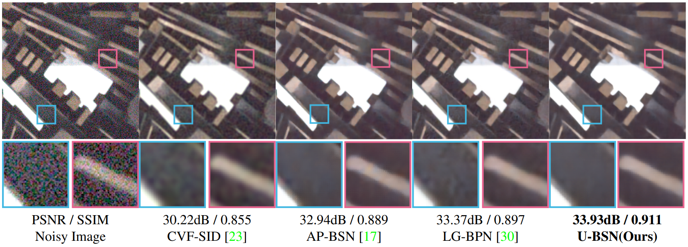

<p align="center">

  <h1 align="center">Theoretical design principles of self-supervised denoising networks</h1>
  <p align="center">
    <a href="https://nica.kaist.ac.kr/people">Hayeong Yu</a>*
    ·
    <a href="https://stevejayh.github.io/">Seungjae Han</a>*
    ·
    <a href="https://nica.kaist.ac.kr/people">Young-Gyu Yoon</a>
  </p>
  <p align="center">
    (* equal contribution)
  </p>
  <h2 align="center">WACV 2025 Oral</h2>

  <h3 align="center"><a href="https://openaccess.thecvf.com/content/WACV2025/html/Yu_Design_Principles_of_Multi-Scale_J-Invariant_Networks_for_Self-Supervised_Image_Denoising_WACV_2025_paper.html">Paper</a> </h3>
  <div align="center"></div>
</p>


<p align="center">
  <a href="">
    
  </a>
</p>

<strong>
<p align="center">
We report the theoretical design principles of self-supervised denoising networks. We show that a U-Net-shaped blind spot network (U-BSN), whose design is derived by following these principles, achieves superior denoising performance at a low computational cost.
</p>
</strong>
<br>


# Installation
Clone the repository and create an anaconda environment using
```setup
pip install -r requirements.txt
```


# Dataset
We follow the dataset setup in AP-BSN. Please click [this link](https://github.com/wooseoklee4/AP-BSN#directory) for a detailed preparation description.


# Evaluation
To evaluate our model, run:

```eval
python test.py -c UBSN_SIDD_val -g 0 --pretrained 'UBSN_SIDD_pretrained.pth' -s UBSN_SIDD_val
python test.py -c UBSN_SIDD_bench -g 0 --pretrained 'UBSN_SIDD_pretrained.pth' -s UBSN_SIDD_bench
```

`-c` refers the configuration name (*.yaml), 
`-g` refers the GPU ID,
`--pretrained` refers to the name of pretrained model file (in the `ckpt/` directory),
`-s` refers to the session name for saving the results.

# Pretrained Models
Download pretrained model in [this link](https://drive.google.com/file/d/1AIMlxZq2UJsIe0ri45x-Ib64gZ5_207g/view?usp=sharing), and place the checkpoint as `ckpt/UBSN_SIDD_pretrained.pth`.

# Citation
If you find our code or paper useful, please cite
```bibtex
@inproceedings{yu2025design,
  title={Design Principles of Multi-Scale J-invariant Networks for Self-Supervised Image Denoising},
  author={Yu, Hayeong and Han, Seungjae and Yoon, Young-Gyu},
  booktitle={Proceedings of the IEEE/CVF Winter Conference on Applications of Computer Vision},
  pages={1309--1318},
  year={2025}
}
```

# Acknowledgements
This project is built upon [AP-BSN](https://github.com/wooseoklee4/AP-BSN). We thank all the authors for their great work and repos. 
